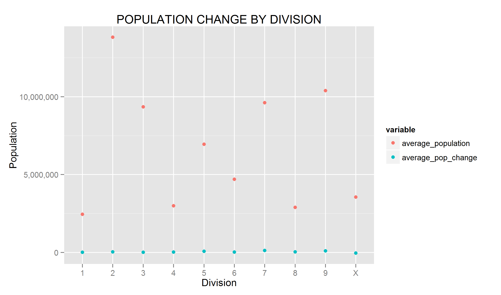
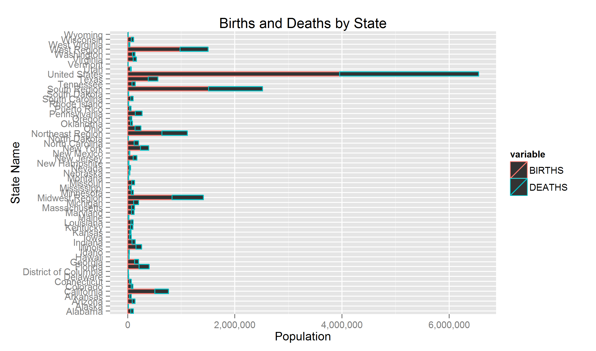
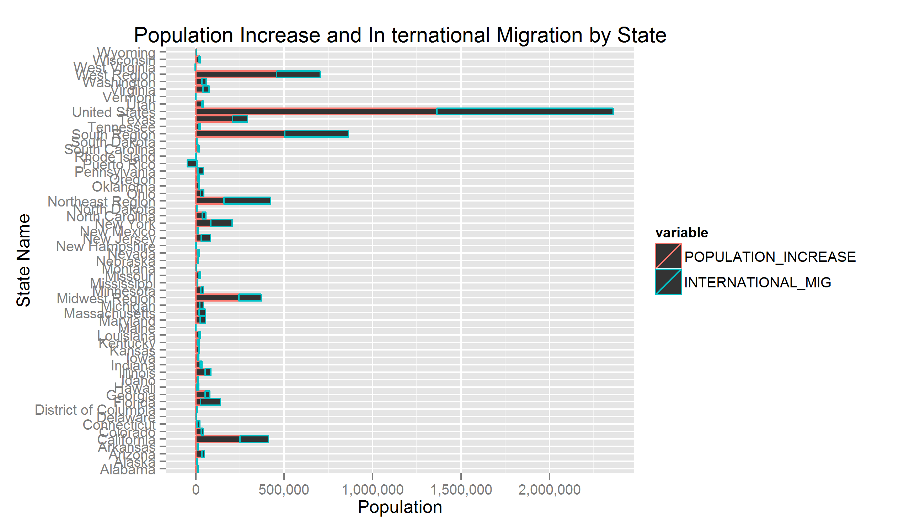

Project 3 Guidelines:
```
1. Create a GitHub Repository named DV_RProject3 (you only need one per project team). Register your Project URL using the "Register Your Project" link on the class website.

2. Clone the project into a DV_RProject3 folder in your Data Visualization Folder, all of the project code should go into this repository.

3. Create an RStudio DV_RProject3 Project (this is where you will do your development)

4. The repository should have the following structure:
  00 Doc
  01 Data
  02 Data Wrangling
  03 Visualizations - this might not be needed if all your visualizations are in  workflows in the 02 Data Wrangling folder.

5. Using KnitR, build an html file that documents the steps to reproduce your project . Use this html file to present a visual story about your data and what you discovered about your data using visualization techniques.

6. Find several data sets (csv files) that can be joined and that you are interested in that is of a "natural science' or "business" orientation or is associated with the major you are studying. The data sets should be a many thousands of rows in the csv file.

7. Register your data set type (e.g., census data) under the PROJECT_3_DATA column using the "Register Your Project" link on the class website. I WANT EACH PROJECT TO HAVE A DIFFERENT DATA SET TYPE. So, don't use a data set type that's already been registered. Yes, this is first-come, first-served.

8. Load the csv files into Oracle as demonstrated in class on Feb 5th.

9. Modify the following query by changing the SQL statement and filling in your USER and PASS to build data frames from your data (Note: the following has changed from what you did in the last project, be sure to use this new format, it's much faster):

  df <- data.frame(fromJSON(getURL(URLencode('129.152.144.84:5001/rest/native  /?query="select * from DIAMONDS"'),httpheader=c(DB='jdbc:oracle:thin:@129.152.144  .84:1521:ORCL', USER='C##cs329e_uteid', PASS='orcl_uteid', MODE='native_mode',   MODEL='model', returnDimensions = 'False', returnFor = 'JSON'), verbose = TRUE)))

Recommended steps for inserting your sql into the statement above:

  Get your sql to work in SQLDeveloper.
  If your sql has double quotes or single quotes in it, escape each of them with \\\ when placing them into the statement above.
  If you insert R variables into your sql, which you need to do when you're using a looping variable from an R loop inside the sql, enclose each of them in double quotes - do not escape these double quotes.
  Each variable that is inserted into your sql statement will need to have something similar to q=q as shown in line 7 of "10 ListsForIfFunctionsPng/ListsForIfFunctionsPng.R"

10. Display an appropriate subset of your data frames in your KnitR document.

11. Describe at least 3 interesting data wrangling sets of operations using %>% in each. Use an inner join, an outer join and at least one other operation under the "Combine Data Sets" column of the Data Wrangling Cheatsheet in your workflows.

12. Produce some interesting visualizations of your wrangled data sets.

13. Include in your html file a PNG image that shows a characterization of the categorical columns (as group by plots) and measure columns (as histograms) for your main table as was done in "10 ListsForIfFunctionsPng/ListsForIfFunctionsPng.R". The query for this should be like the following with the appropriate changes to the query, USER, and PASS:

  categoricals <- eval(parse(text=substring(getURL(URLencode('http://129.152.144.84:5001/rest/native/?query="select * from emp"'), httpheader=c(DB='jdbc:oracle:thin:@129.152.144.84:1521:ORCL', USER='C##cs329e_uteid', PASS='orcl_uteid', MODE='native_mode', MODEL='model', returnFor = 'R', returnDimensions = 'True'), verbose = TRUE), 1, 2^31-1)))

14. Be sure to use whatever is appropriate from the Beautiful Plotting tutorialsin steps 12 and 13.
```
```{r}
source("../Rprofile.R", echo = FALSE) #load libraries
```
```{r}
source("../01 Data/dataframes.R", echo = TRUE) #load dataframe
tbl_df(df1)
tbl_df(df2)
```
```{r}
source("../01 Data/joindata.R", echo = TRUE) #load join dataframes
tbl_df(dfjoinouter)
tbl_df(dfjoininner)
tbl_df(dfjoinself)
```
```{r}
source("../02 Data Wrangling/x.R", echo = TRUE) #data wrangling done on dataframes
source("../02 Data Wrangling/y.R", echo = TRUE)
```
```
xvis <- melt (x, id.vars="DIVISION", measure.vars = c("average_population", "average_pop_change"))
x0 <- xvis %>% arrange(DIVISION)
x0 = x0[-1,]
x0 = x0[-1,]
x1 <- ggplot(x0, aes(x=DIVISION, y=value, color=variable))+geom_point()
x1 + xlab("Division") + ylab("Population") + ggtitle("POPULATION CHANGE BY DIVISION") + scale_y_continuous(label = comma)
ggsave(file="xvis.png", path="00 Doc")
```

```
yvis <- melt (y, id.vars="NAME", measure.vars = c("BIRTHS", "DEATHS"))
y1 <- ggplot(yvis, aes(x=NAME, y=value, color=variable))+geom_bar(stat="identity")
y1 + xlab("State Name") + ylab("Population") + ggtitle("Births and Deaths by State") + scale_y_continuous(label = comma) +coord_flip()
ggsave(file="yvis.png", path="00 Doc")
```

```
zvis <- melt (dfjoinself, id.vars="NAME", measure.vars = c("POPULATION_INCREASE", "INTERNATIONAL_MIG"))
z1 <- ggplot(zvis, aes(x=NAME, y=value, color=variable))+geom_bar(stat="identity")
z1 + xlab("State Name") + ylab("Population") + ggtitle("Population Increase and In ternational Migration by State") + scale_y_continuous(label = comma) +coord_flip()
ggsave(file="zvis.png", path="00 Doc")
```

```
myplot <- function(df, x) {
  names(df) <- c("x", "n")
  ggplot(df, aes(x=x, y=n)) + geom_point()
}

categoricals <- eval(parse(text=substring(gsub(",)", ")", getURL(URLencode('http://129.152.144.84:5001/rest/native/?query="select * from POPEST"'), httpheader=c(DB='jdbc:oracle:thin:@129.152.144.84:1521:ORCL', USER='C##cs329e_js64948', PASS='orcl_js64948', MODE='native_mode', MODEL='model', returnFor = 'R', returnDimensions = 'True'), verbose = TRUE)), 1, 2^31-1)))

dff <- data.frame(fromJSON(getURL(URLencode('129.152.144.84:5001/rest/native/?query="select * from POPEST"'),httpheader=c(DB='jdbc:oracle:thin:@129.152.144.84:1521:ORCL', USER='C##cs329e_js64948', PASS='orcl_js64948', MODE='native_mode', MODEL='model', returnDimensions = 'False', returnFor = 'JSON'), verbose = TRUE)))

l <- list()
for (i in names(dff)) { 
  if (i %in% categoricals[[1]]) {
    r <- data.frame(fromJSON(getURL(URLencode('129.152.144.84:5001/rest/native/?query="select \\\""i"\\\", count(*) n from POPEST group by \\\""i"\\\" "'),httpheader=c(DB='jdbc:oracle:thin:@129.152.144.84:1521:ORCL', USER='C##cs329e_js64948', PASS='orcl_js64948', MODE='native_mode', MODEL='model', returnDimensions = 'False', returnFor = 'JSON', i=i), verbose = TRUE)))
    p <- myplot(r,i)
    print(p) 
    l[[i]] <- p
  }
}

png("/Users/User/Documents/UT/Spring 2015/CS 329E Data Vis/DV_RProject3/00 Doc/categoricals.png", width = 50, height = 30, units = "in", res = 72)
grid.newpage()
pushViewport(viewport(layout = grid.layout(3, 12)))   

print(l[[1]], vp = viewport(layout.pos.row = 1, layout.pos.col = 1:3))
print(l[[2]], vp = viewport(layout.pos.row = 1, layout.pos.col = 4:6))
print(l[[3]], vp = viewport(layout.pos.row = 1, layout.pos.col = 7:9))
print(l[[4]], vp = viewport(layout.pos.row = 1, layout.pos.col = 10:12))
print(l[[5]], vp = viewport(layout.pos.row = 2, layout.pos.col = 1:3))
print(l[[6]], vp = viewport(layout.pos.row = 2, layout.pos.col = 4:6))
print(l[[7]], vp = viewport(layout.pos.row = 2, layout.pos.col = 7:9))
print(l[[8]], vp = viewport(layout.pos.row = 2, layout.pos.col = 10:12))
print(l[[9]], vp = viewport(layout.pos.row = 3, layout.pos.col = 1:3))
print(l[[10]], vp = viewport(layout.pos.row = 3, layout.pos.col = 4:6))
print(l[[11]], vp = viewport(layout.pos.row = 3, layout.pos.col = 7:9))
print(l[[12]], vp = viewport(layout.pos.row = 3, layout.pos.col = 10:12))


dev.off()
```
